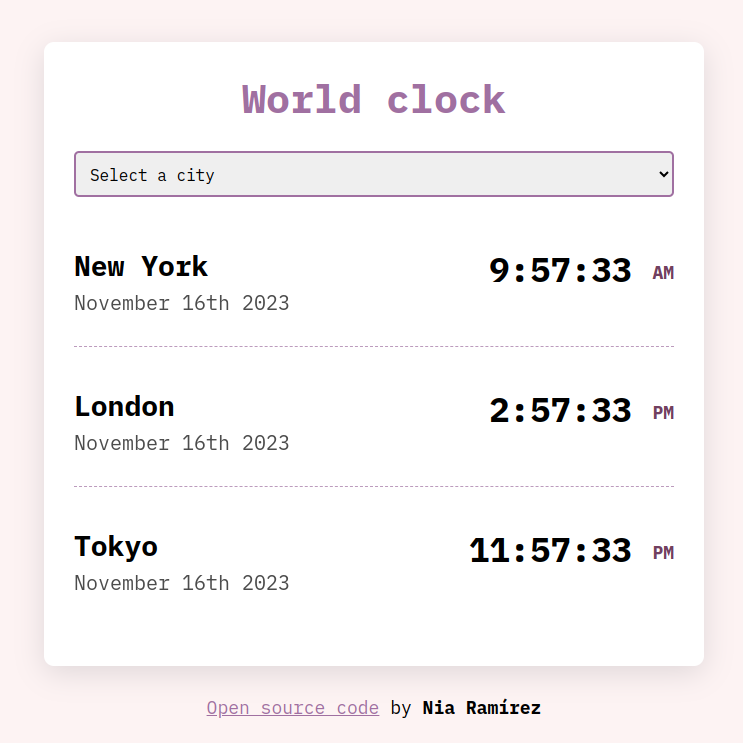

# Basic World Clock

Welcome to the Basic World Clock repository! This project is a simple yet functional world clock application built with HTML, CSS, and JavaScript using Moment.js. It allows users to view the current time in various cities around the world.

## Table of Contents

- [Basic World Clock](#basic-world-clock)
  - [Table of Contents](#table-of-contents)
  - [About](#about)
  - [Features](#features)
  - [Technologies Used](#technologies-used)
  - [Installation](#installation)
  - [Contributing](#contributing)
  - [Screenshots](#screenshots)

## About

The Basic World Clock is a handy tool for anyone who needs to keep track of time in different time zones. It also has a funcionality to display the date and time of your current location. 

## Features

- Display current time for multiple cities around the world
- Responsive design for use on various devices
- Simple and intuitive user interface

## Technologies Used

- **HTML:** For the structure of the application
- **CSS:** For styling the application
- **JavaScript:** For handling logic and interactivity
- **Moment.js:** For working with dates and times

## Installation

To run this project locally, simply download or clone the repository and open the `index.html` file in your web browser.

```bash
git clone git@github.com:estefaniaramirezmnt/World-Clock-Project.git
```
```bash
cd World-Clock-Project
```

## Contributing

If you would like to contribute to this project, please feel free to open an issue or submit a pull request on GitHub.


## Screenshots


